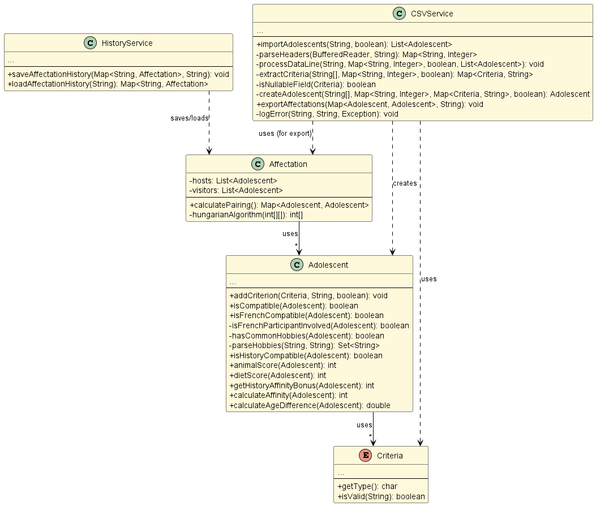

= SAE 2.01 - 2.02 - Rapport de Développement Orienté Objet
:author: Yann Renard, Yanis Mekki, Rémy Martin
:revdate: 23/05/2025
:doctype: report
:toc: left
:toclevels: 3
:sectnums:
:icons: font
:source-highlighter: highlightjs

## Semaine 1-2

### UML Version 1-2

image::UML_plantuml/SAE_UML_Version1.png[UML Version 1-2]

## Semaine 3-4

### UML Version 3-4

image::UML_plantuml/SAE_UML_Version2.png[UML Version 3-4]

### Principales évolutions (Version 1-2 vers Version 3-4)

Voici le résumé des modifications apportées dans le répertoire `src` depuis le commit `POO-v1` (correspondant à la Version 1-2) jusqu'à la version actuelle (correspondant à la Version 3-4) :

Les modifications se concentrent sur les deux principaux aspects correspondant aux objectifs des semaines 3 et 4 :
1. **Gestion de la validité des critères par un mécanisme d'exception**
2. **Développement des règles spécifiques de compatibilité pour certains pays**

==== Fichier `src/main/Adolescent.java`

*   **Méthode `addCriterion(Criteres criterion, String value, boolean isHost)`:**
    **   La signature a changé pour inclure la déclaration `throws IllegalArgumentException`.
    **   **Validation améliorée :** La méthode `criterion.isValid(value)` est appelée en premier et peut lever une `IllegalArgumentException` si la valeur n'est pas valide.
    **   **Filtre HOST/GUEST :** Empêche d'ajouter un critère de type `GUEST_` à un adolescent hôte et vice-versa pour maintenir la cohérence des données.

*   **Évolution des méthodes de compatibilité :**
    **   `isAnimalCompatible(Adolescent other)` renommée en `animalScore(Adolescent other)` : retourne maintenant un score numérique (`0` si compatible, `-25` si incompatible).
    **   `isDietCompatible(Adolescent other)` renommée en `dietScore(Adolescent other)` : retourne un score numérique avec gestion robuste des `NullPointerException` lors du traitement des régimes alimentaires.

*   **Nouvelle méthode `isFrenchCompatible(Adolescent other)`:**
    **   Vérifie la compatibilité si l'un des adolescents est français.
    **   Si aucun n'est français, ils sont compatibles.
    **   Si l'un est français, ils doivent avoir au moins un hobby en commun.
    **   Gère les `NullPointerException` lors du traitement des hobbies.

*   **Méthode `isCompatible(Adolescent other)`:**
    **   La logique de compatibilité a été modifiée pour inclure la vérification `isFrenchCompatible(other)`.
    **   Utilise maintenant les nouvelles méthodes `animalScore()` et `dietScore()` pour déterminer la compatibilité.

==== Fichier `src/main/Criteres.java`

*   **Méthode `isValid(String valeur)`**:
    **   Déclare maintenant `throws IllegalArgumentException`.
    **   **Logique de validation grandement améliorée et plus stricte :**
        ***   Gère `null` différemment selon le critère (permis pour `PAIR_GENDER`, `HISTORY`, `GUEST_FOOD`, `HOST_FOOD`, `HOBBIES` mais lève une exception pour `GUEST_ANIMAL_ALLERGY`, `HOST_HAS_ANIMAL`, `GENDER`).
        ***   Retourne `true` si toutes les validations passent.
        ***   Lève une `IllegalArgumentException` avec un message d'erreur spécifique si la validation échoue.

## Semaine 5-6

### UML Version 5-6

### Principales évolutions (Version 3-4 vers Version 5-6)

==== Fichier `src/main/Affectation.java`

*   **Méthode `calculatePairing()`:**
    ** Crée une matrice de coût où chaque élément `[i][j]` représente le négatif de l'affinité entre le i-ème visiteur et le j-ème hôte. Ce coût est calculé avec Adolescent.calculateAffinity(Adolescent hôte).
    ** Si le nombre d'hôtes et de visiteurs est différent, la matrice de coût est complétée avec des valeurs maximales pour la rendre carrée.
    ** Appelle la méthode `hungarianAlgorithm()` pour obtenir l'affectation optimale sous forme d'un tableau d'indices en utilisant donc l'algorithme hongrois.
    ** Construit et retourne une `Map<Adolescent, Adolescent>` où la clé est un visiteur et la valeur est l'hôte qui lui est apparié.

*   **Méthode `hungarianAlgorithm(int[][] costMatrix)` (privée) :**
    ** Implémente l'algorithme hongrois pour résoudre le problème d'affectation linéaire.  
    ** A cette fin il utilise plusieurs tableaux :
        * `lx` et `ly`: les coûts temporaires pour chaque visiteur et chaque hôte.
        * `xy`: garde en mémoire quel hôte est actuellement attribué à quel visiteur.
        * `yx`: l'inverse de `xy`, quel visiteur est attribué à quel hôte.
        * `queue`, `prev`, `S`, `T`: les tableaux utilisés pour l'exploration des possibilités d'amélioration de l'appariement.  
    ** Initialise les tableaux ci dessus et trouve une affectation initiale.
    ** Itérativement, recherche des chemins augmentants pour améliorer l'affectation jusqu'à ce qu'elle soit optimale.
    ** Retourne un tableau `xy` où `xy[i]` est l'indice de la colonne (l'hôte) affecté à la ligne `i` (le visiteur).

==== Fichier `src/main/CSVService.java`

==== Fichier `src/main/CSVService.java`

*   **Méthode `importAdolescents(String filePath, boolean isHost)` :**
    ** Prend en paramètre le chemin du fichier CSV et un booléen `isHost` pour indiquer si les adolescents sont des hôtes ou des visiteurs.
    ** Lit le fichier ligne par ligne :
        * Appelle `parseHeaders()` pour lire et valider la ligne d'en-tête et construire une map des en-têtes avec leurs indices.
        * Pour chaque ligne de données, appelle `processDataLine()` pour créer un objet `Adolescent`.
    ** Gère les `IOException` lors de la lecture du fichier.
    ** Retourne une `List<Adolescent>` contenant tous les adolescents importés.

*   **Méthode `parseHeaders(BufferedReader br, String filePath)` (privée) :**
    ** Lit la première ligne du fichier CSV (censée être l'en-tête).
    ** Divise la ligne en fonction du `CSV_DELIMITER`.
    ** Crée une `Map<String, Integer>` associant chaque nom d'en-tête (en majuscules et sans espaces superflus) à son index de colonne.
    ** Vérifie si tous les `REQUIRED_HEADERS` sont présents dans la map. Si ce n'est pas le cas, un message d'erreur est journalisé avec LogError(String message, String context, Exception e) et une map vide est retournée.
    ** Retourne la `headerMap` ou une map vide en cas d'erreur.

*   **Méthode `processDataLine(String line, Map<String, Integer> headerMap, boolean isHost, List<Adolescent> adolescents)` (privée) :**
    ** Traite une seule ligne de données du fichier CSV.
    ** Divise la ligne en un tableau de chaînes de caractères (`data`).
    ** Vérifie que le nombre de colonnes correspond au nombre d'en-têtes.
    ** Appelle `extractCriteria()` pour extraire les critères spécifiques de l'adolescent.
    ** Appelle `createAdolescent()` pour instancier un objet `Adolescent`.
    ** Ajoute l'adolescent créé à la liste des adolescents.
    ** Gère les exceptions génériques qui pourraient survenir lors du traitement d'une ligne de données.

*   **Méthode `extractCriteria(String[] data, Map<String, Integer> headerMap, boolean isHost)` (privée) :**
    ** Parcourt les en-têtes du fichier CSV.
    ** Pour les en-têtes qui ne sont pas des `REQUIRED_HEADERS`, tente de les convertir en énumération `Criteria`.
    ** Ignore les critères qui sont incompatibles avec le type d'adolescent (par exemple, un hôte ne devrait pas avoir de critère `GUEST_ANIMAL_ALLERGY`).
    ** Récupère la valeur correspondante dans le tableau `data`.
    ** Si la valeur est vide, vérifie si le critère est "nullable" (peut être nul) en utilisant `isNullableField()`. Si oui, la valeur `null` est stockée pour ce critère. Sinon, la valeur est stockée telle quelle.
    ** Gère les `IllegalArgumentException` si un en-tête n'est pas reconnu.
    ** Retourne une `Map<Criteria, String>` des critères extraits.

*   **Méthode `isNullableField(Criteria critere)` (privée) :**
    ** Une méthode utilitaire qui retourne `true` si le critère donné peut avoir une valeur `null` (c'est à dire: `PAIR_GENDER`, `HISTORY`, `GUEST_FOOD`, `HOST_FOOD`, `HOBBIES`), et `false` sinon.

* **Méthode `createAdolescent(String[] data, Map<String, Integer> headerMap, Map<Criteria, String> criteria, boolean isHost)` (privée) :**
    * Récupère les informations de base (nom, prénom, pays, date de naissance, genre) du tableau `data` en utilisant la `headerMap`.
    * Parse la date de naissance en `LocalDate`.
    * Instancie et retourne un nouvel objet `Adolescent` en lui donnant les informations de base, les critères extraits et le statut `isHost`.

*   **Méthode `exportAffectations(Map<Adolescent, Adolescent> pairings, String filePath)` :**
    ** Exporte les paires d'adolescents formées vers un fichier CSV.
    ** Prend en paramètre une `Map` des appariements (Visiteur -> Hôte) et le chemin du fichier de sortie.
    ** Écrit la ligne d'en-tête (`EXPORT_HEADERS`) dans le fichier.
    ** Pour chaque paire dans la `pairings` map, extrait les informations pertinentes (nom, prénom, pays) pour le visiteur et l'hôte.
    ** Écrit ces informations sous forme de ligne CSV dans le fichier.
    ** Gère les `IOException` lors de l'écriture du fichier.

*   **Méthode `logError(String message, String context, Exception e)` (privée) :**
    ** Une méthode pour journaliser les messages d'erreur dans la console (`System.err`).
    ** Permet d'inclure un message principal, un contexte (par exemple, la ligne CSV en cause) et une exception optionnelle pour des détails supplémentaires.

==== Fichier `src/main/HistoryService.java`

*   **Méthode `saveAffectationHistory(Map<String, Affectation> history, String filePath)` :**
    ** Prend en paramètre une `Map` où la clé est une `String` (représentant une clé unique pour une affectation, avec "Date\_PaysOrigine\_PaysDestination") et la valeur est un objet de type `Affectation`.
    ** Prend également le chemin du fichier (`filePath`) où l'historique doit être sauvegardé.
    ** Utilise `FileOutputStream` et `ObjectOutputStream` pour écrire l'objet `Map` complet dans le fichier spécifié.
    ** Gère les `IOException` qui pourraient survenir pendant l'écriture et lors de la fermeture des flux, en affichant des messages d'erreur sur `System.err`.
    ** Assure la fermeture des flux (`ObjectOutputStream` et `FileOutputStream`) dans un bloc `finally` pour garantir que les ressources sont libérées même en cas d'erreur.

*   **Méthode `loadAffectationHistory(String filePath)` :**
    ** Prend en paramètre le chemin du fichier (`filePath`) à partir duquel l'historique doit être chargé.
    ** Utilise `FileInputStream` et `ObjectInputStream` pour lire l'objet depuis le fichier.
    ** Vérifie que l'objet lu est bien une instance de `Map` avant de le caster.
    ** Gère plusieurs types d'exceptions :
        * `IOException`: Si le fichier n'est pas trouvé (cas courant lors de la première exécution de l'application) ou s'il y a une erreur de lecture.
    ** Assure la fermeture des flux (`ObjectInputStream` et `FileInputStream`) dans un bloc `finally`.
    ** Retourne la `Map` chargée, ou une `HashMap` vide si le fichier n'existe pas ou si une erreur de chargement survient.

==== Fichier `src/main/Adolescent.java`
*   ** Grande amélioration de la lisibilité du code.**

*   ** Constructeur principal (`Adolescent(...)`) :**
    ** Appelle maintenant deux méthodes privées pour gérer l'initialisation des critères : `initializeGenderCriterion()` et `initializeOtherCriteria()` plutôt qu'une gestion en interne.

*   ** Suppression de l'autre constructeur ne servant à rien de part la logique de l'importation**

*   **Méthode `initializeGenderCriterion(String gender)` (privée) :**
    ** Gère spécifiquement l'initialisation du critère `GENDER` en reprennant la même logique que précedemment.
    ** Vérifie si la valeur du genre est non nulle et non vide.
    ** Utilise `Criteria.GENDER.isValid(gender)` pour valider le critère.
    ** En cas d'`IllegalArgumentException` lors de la validation, affiche un message d'erreur.

*   **Méthode `initializeOtherCriteria(Map<Criteria, String> criteriaMap, boolean isHost)` (privée) :**
    ** Itère sur la map des critères fournie.
    ** Pour chaque critère, appelle la méthode `addCriterion()` pour l'ajouter à l'adolescent.
    ** L'appel à `addCriterion()` est encapsulé dans un bloc `try-catch` pour gérer les `IllegalArgumentException` qui pourraient être levées lors de la validation ou de l'ajout du critère auquel cas affiche un message d'erreur en cas d'exception.

*   **Méthode 'addCriterion(Criteres criterion, String value, boolean isHost)':**
    ** Ajout au filtre de la vérification de la non existence préalable du critère et peut lever une `IllegalArgumentException` si le critère est déjà présent.

*   **Méthode `isFrenchCompatible(Adolescent other)` :**
    ** Refactorisation de la logique.
    ** Utilise maintenant la méthode `isFrenchParticipantInvolved(Adolescent other)` pour vérifier si l'un des participants est français.
    ** Utilise maintenant la méthode `hasCommonHobbies(Adolescent other)` pour vérifier s'ils ont au moins 1 hobbie en commun si l'un d'eux est français.

* **Nouvelle méthode privée `isFrenchParticipantInvolved(Adolescent other)` :**
    * Retourne `true` si cet adolescent ou l'autre adolescent (`other`) est de nationalité française grâce à la constante FRANCE. 

* **Méthode `hasCommonHobbies(Adolescent other)` :**
    * Utilise maintenant la méthode `parseHobbies(String hobbies, String personName)` pour convertir la chaîne de hobbies en un Set de hobbies.
    * Simplification de la logique de vérification des hobbies communs grâce à `Collections.disjoint()` pour vérifier s'il existe des éléments communs entre les ensembles de hobbies. Retourne `true` s'il n'y a pas d'éléments disjoints (donc au moins un hobby en commun).

* **Nouvelle méthode privée `parseHobbies(String hobbies, String personName)` :**
    * Prend une chaîne de hobbies (séparés par `,`) et le nom de la personne (ne servant qu'en cas d'erreur).
    * Divise la chaîne en hobbies individuels, supprime les espaces superflus et les ajoute à un HashSet.
    * Gère les `NullPointerException` qui pourraient survenir si la chaîne de hobbies est nulle.

==== Fichier `src/main/Criteres.java`

* **Rien de Nouveau**

==== Fichier `src/main/Main.java`

*   ** Amélioration de la lisibilité du code.**

*   ** `main(String[] args)`:**
    * Point d'entrée de l'application.
    * Crée une instance de `Main` et appelle la méthode `run()`.

*   **`run()`:**
    *   ** Orchestre le processus complet d'appariement :**
        1.  ** `createSampleFilesIfNotExists()`:
                ** Crée les fichiers CSV d'exemple (`sample_hosts.csv` et `sample_guests.csv`) s'ils n'existent pas déjà. Ceci permet d'avoir des données par défaut pour tester l'application.
        
        2.  ** Chargement des données :
                ** Utilise la classe `CSVService` pour importer les listes d'hôtes/visiteurs depuis les fichiers CSV et affiche le nombre d'hôtes et de visiteurs chargés. 
                ** Dans le cas où aucun hôte ou visiteur n'est chargé, affiche un message d'erreur et arrête le processus.
        
        3.  ** Calcul des affectations :
                ** Crée une instance de la classe `Affectation` avec les listes d'hôtes et de visiteurs, puis appelle la méthode `calculatePairing()` pour obtenir les paires optimales seulon l'algorithme hongrois.
                ** Gère les exceptions potentielles lors du calcul de l'appariement et continue avec des paires vides en cas d'erreur.
                ** Puis affiche le nombre de paires formées.
        
        4.  ** Affichage des résultats en appellant la méthode `displayPairings()` pour afficher les paires formées, ainsi que quelques informations sur les adolescents et leur affinité calculée.
            ** Gère les erreurs potentielles (pouvant subvenir lors du calcul d'affinité).
        
        5.  ** Export des résultats :
                ** Utilise `CSVService` pour exporter les paires d'adolescents vers un fichier CSV (`exported_affectations.csv`). 
                ** Gère les exceptions potentielles lors de l'export.
        
        6.  ** Gestion de l'historique :** Appelle la méthode `saveToHistory()` pour sauvegarder l'affectation actuelle dans l'historique. Gère les exceptions potentielles lors de la sauvegarde.
    * Encapsule l'ensemble du processus dans un bloc `try-catch` pour gérer les erreurs critiques de l'application.

* **`displayPairings(Map<Adolescent, Adolescent> pairings)`:**
    * Prend en entrée une map représentant les paires d'adolescents (visiteur -> hôte).
    * Affiche dans la console les paires formées, en indiquant le nom, prénom et pays d'origine de chaque adolescent de la paire, ainsi que leur affinité calculée (si le calcul réussit).
    * Gère le cas où aucune paire n'est formée et les potentielles erreurs lors de l'itération sur les paires ou du calcul de l'affinité.

* **`saveToHistory(Affectation affectation)`:**
    * Prend en entrée l' `Affectation` courante.
    * Charge l'historique existant à l'aide de `HistoryService`.
    * Génère une clé unique pour cette affectation en utilisant la date et les pays d'origine des hôtes et des visiteurs via `generateHistoryKey()`.
    * Ajoute l'affectation courante à l'historique avec cette clé.
    * Sauvegarde l'historique mis à jour à l'aide de `HistoryService`.
    * Affiche un message indiquant que l'historique a été mis à jour et le nombre total d'affectations dans l'historique.
    * Relance toute exception survenue lors de la sauvegarde pour permettre à l'utilisateur de la gérer.

* **`generateHistoryKey(Affectation affectation)`:**
    * Génère une clé unique pour identifier une affectation dans l'historique.
    * Cette clé est basée sur la date actuelle et les pays d'origine des hôtes et des visiteurs impliqués dans l'affectation.
    * Gère les potentielles erreurs lors de la récupération des pays et retourne une clé de secours en cas d'échec.

* **`createSampleFilesIfNotExists()`:**
    * Vérifie si les fichiers CSV d'exemple pour les hôtes et les visiteurs existent.
    * Si l'un des fichiers n'existe pas, il appelle les méthodes `createHostsFile()` et `createGuestsFile()` pour les créer avec des données de démonstration.

* **`createHostsFile()`:**
    * Crée le fichier `sample_hosts.csv` avec quelques lignes de données d'exemple pour les hôtes, si le fichier n'existe pas déjà.

* **`createGuestsFile()`:**
    * Crée le fichier `sample_guests.csv` avec quelques lignes de données d'exemple pour les visiteurs, si le fichier n'existe pas déjà.
