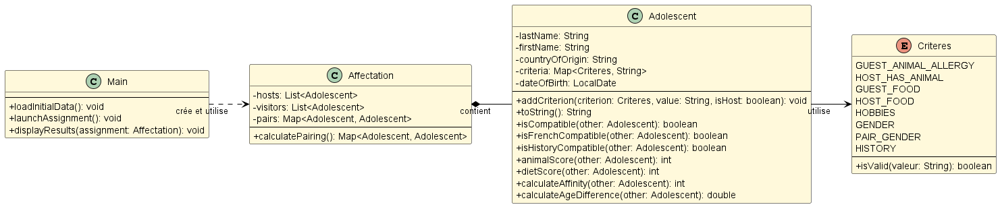

= SAE 2.01 - 2.02 - Rapport de Développement Orienté Objet
:author: Yann Renard, Yanis Mekki, Rémy Martin
:revdate: 23/05/2025
:doctype: report
:toc: left
:toclevels: 3
:sectnums:
:icons: font
:source-highlighter: highlightjs

## Semaine 1-2

### UML Version 1-2

## Semaine 3-4

### UML Version 3-4

### Principales évolutions (Version 1-2 vers Version 3-4)

Voici le résumé des modifications apportées dans le répertoire `src` depuis le commit `POO-v1` (correspondant à la Version 1-2) jusqu'à la version actuelle (correspondant à la Version 3-4) :

Les modifications se concentrent sur les deux principaux aspects correspondant aux objectifs des semaines 3 et 4 :
1. **Gestion de la validité des critères par un mécanisme d'exception**
2. **Développement des règles spécifiques de compatibilité pour certains pays**

==== Fichier `src/main/Adolescent.java`

*   **Méthode `addCriterion(Criteres criterion, String value, boolean isHost)`:**
    **   La signature a changé pour inclure la déclaration `throws IllegalArgumentException`.
    **   **Validation améliorée :** La méthode `criterion.isValid(value)` est appelée en premier et peut lever une `IllegalArgumentException` si la valeur n'est pas valide.

*   **Nouvelle méthode `isFrenchCompatible(Adolescent other)`:**
    **   Vérifie la compatibilité si l'un des adolescents est français.
    **   Si aucun n'est français, ils sont compatibles.
    **   Si l'un est français, ils doivent avoir au moins un hobby en commun.
    **   Gère les `NullPointerException` lors du traitement des hobbies.

*   **Méthode `isCompatible(Adolescent other)`:**
    **   La logique de compatibilité a été modifiée pour inclure la vérification `isFrenchCompatible(other)`.

==== Fichier `src/main/Criteres.java`

*   **Méthode `isValid(String valeur)`**:
    **   Déclare maintenant `throws IllegalArgumentException`.
    **   **Logique de validation grandement améliorée et plus stricte :**
        ***   Gère `null` différemment selon le critère (permis pour `PAIR_GENDER`, `HISTORY`, `GUEST_FOOD`, `HOST_FOOD`, `HOBBIES` mais lève une exception pour `GUEST_ANIMAL_ALLERGY`, `HOST_HAS_ANIMAL`, `GENDER`).
        ***   Retourne `true` si toutes les validations passent.
        ***   Lève une `IllegalArgumentException` avec un message d'erreur spécifique si la validation échoue.
