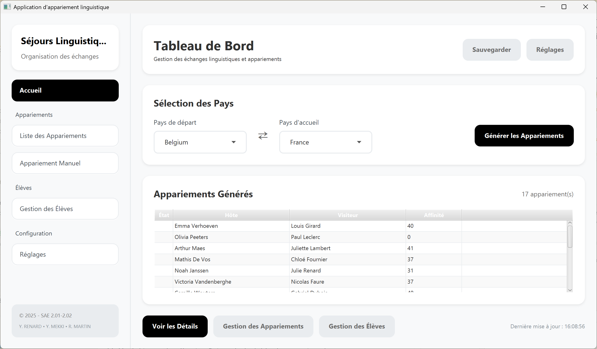

  
# SAE2.01/2.02 - Développement d'une application - Rapport d'IHM

**Groupe : D7**

## Informations du projet
- **Repository GitLab** : https://gitlab.univ-lille.fr/sae2.01-2.02/2025/D7
- **Commit de rendu** : *@499e3d3*

## Capture d'écran de l'application finale

## Choix de conception et critères ergonomiques

### Justification des choix de conception
*Notre application de gestion d'échanges linguistiques a été conçue en plaçant l'utilisateur au centre de nos préoccupations. L'interface vise à être à la fois puissante, intuitive et visuellement agréable, en s'appuyant sur les critères ergonomiques fondamentaux.*

1. **Guidage et retour d'information**
   - **Comment votre interface guide-t-elle l'utilisateur ?**
   L'interface est structurée autour d'une barre de navigation latérale (`Sidebar`) qui offre un accès clair et permanent aux sections principales : Tableau de Bord, Gestion des Élèves, Liste des Appariements, Appariement Manuel et Réglages. Cette organisation spatiale permet à l'utilisateur de se repérer facilement. Des intitulés clairs, des icônes et des descriptions textuelles sur chaque vue (par exemple, "Gérez et supervisez tous les appariements") guident l'utilisateur dans ses actions. De plus, des processus logiques sont mis en place, comme le formulaire de création d'élève qui n'apparaît que sur clic du bouton "Créer un élève", évitant de surcharger l'interface.

   - **Quels retours visuels avez-vous implémentés ?**
   De nombreux retours visuels sont présents :
    - **Affichage dynamique :** Les listes et tableaux se mettent à jour instantanément après une action (ajout d'élève, génération d'appariements).
    - **Notifications et labels de statut :** Des labels indiquent le nombre d'éléments, le statut des appariements (Validé, En attente), ou la date de dernière mise à jour.
    - **Composants interactifs :** Les boutons changent d'état au survol, et des composants personnalisés comme le switch "Hôtes/Visiteurs" fournissent un retour tactile et visuel immédiat. La vue d'appariement manuel offre un aperçu détaillé du score d'affinité *avant* la création, fournissant un retour complet sur les conséquences d'un choix.
    - **Barres de progression/Sliders :** Dans les réglages, les sliders de pondération affichent en temps réel le pourcentage choisi.

2. **Charge de travail**
   - **Comment avez-vous minimisé les actions requises ?**
   Nous avons cherché à réduire le nombre de clics. Par exemple, l'import de données via des fichiers CSV permet d'ajouter des dizaines d'élèves en quelques actions intuitives. La génération automatique des appariements condense un processus complexe en un clic sur "Générer les Appariements". Les filtres et la barre de recherche dans la liste des appariements permettent d'accéder rapidement à l'information souhaitée sans avoir à parcourir manuellement toute la liste.

   - **Quelles solutions pour réduire la charge cognitive ?**
   L'interface est découpée en "cartes" (cards) qui regroupent logiquement les informations et les actions (ex: "Sélection des Pays", "Statistiques", "Filtres"). Cette organisation modulaire rend l'information plus facile à analyser. L'utilisation d'un design cohérent (polices, couleurs, espacements) et d'une hiérarchie visuelle claire (titres plus grands, textes secondaires en gris) réduit l'effort nécessaire pour comprendre la structure de la page.

3. **Contrôle utilisateur**
   - **Quelles options de contrôle avez-vous données à l'utilisateur ?**
   L'utilisateur dispose d'un contrôle total sur le processus. Il peut :
    - **Gérer les données :** Ajouter des élèves manuellement ou via import, modifier leurs informations.
    - **Configurer l'algorithme :** La vue "Réglages" est le point central de ce contrôle, permettant d'ajuster finement la pondération de chaque critère d'appariement (âge, genre, hobbies...).
    - **Contrôler les appariements :** Lancer le calcul automatique, mais aussi créer des paires manuellement, valider, ou supprimer des appariements existants.
    - **Exporter :** Exporter les résultats et les configurations pour une utilisation externe.

   - **Comment gérez-vous les erreurs et leur correction ?**
   L'application permet de corriger les erreurs à plusieurs niveaux. Une erreur de saisie sur un élève peut être corrigée en le modifiant. L'appariement manuel permet de passer outre l'algorithme si nécessaire. La possibilité de réinitialiser les filtres ou les pondérations des réglages permet de revenir facilement à un état par défaut.

4. **Homogénéité et cohérence**
   - **Comment avez-vous maintenu une cohérence visuelle ?**
   Au-delà de l'expérience utilisateur, l'homogénéité de l'interface est un élément clé pour ne pas perdre l'utilisateur. Une cohérence a donc été appliquée sur l'ensemble de nos composants (boutons, switch, combobox, cartes...). Nous avons utilisé un système de design cohérent : des couleurs récurrentes (#f8f9fa pour le fond, #ffffff pour les cartes), des polices et tailles de texte standardisées, des espacements réguliers et des ombres portées identiques pour les cartes, créant une identité visuelle unifiée et professionnelle sur toutes les vues.

   - **Quels patterns de design avez-vous utilisés ?**
   Nous avons utilisé plusieurs patterns de design reconnus :
    - **Dashboard :** Le tableau de bord principal offre une vue d'ensemble synthétique des informations clés.
    - **Master-Detail :** La vue "Gestion des Élèves" présente une liste (master) et un formulaire d'édition (detail).
    - **Wizard (assistant) :** Le processus d'appariement manuel, bien que sur une seule page, guide l'utilisateur étape par étape (sélection, aperçu, création).
    - **Data Table :** Les tableaux d'appariements sont utilisés pour afficher des données denses de manière structurée, avec des options de tri et de filtrage.

## Contributions de l'équipe

### Répartition des tâches
*Détailler ici la contribution de chaque membre :*

| Membre | Contributions principales | Compétences exploitées |
|--------|-------------------------|----------------------|
| Yann Renard | Intégralité de la partie IHM (conception et développement), création des vues FXML, gestion des contrôleurs JavaFX, UX/UI. | JavaFX, FXML (modification à la main après passage dans SceneBuilder), Figma, SceneBuilder |
| Yanis Mekki | Stylisation de certaines parties de l'interface après la première maquette haute fidélité réalisée | JavaFX, Figma |
| Rémy Martin | Premiers jets du design et des mockups sur Figma | Figma |

### Organisation du travail
*Expliquer comment nous avons :*
- **Organisé le travail d'équipe :** Nous avons utilisé GitLab pour le versioning du code et la gestion des tâches. Des points réguliers ont été faits pour synchroniser l'avancée avec la partie POO.
- **Géré les compétences de chacun :** La répartition s'est faite naturellement en fonction des affinités : Rémy sur la conception initiale, Yann sur le développement front-end complet, et Yanis sur le peaufinage pour accelerer le développement.
- **Surmonté les difficultés rencontrées :** La complexité de certains composants JavaFX a nécessité des recherches et des expérimentations.

## Mockups
*Les mockups sont disponibles dans le répertoire `mockups/`*

## Informations supplémentaires

### Points forts du projet
- L'interface est très complète et offre un haut niveau de contrôle à l'utilisateur, notamment avec la pondération des critères.
- L'application présente une forte cohérence visuelle et une expérience utilisateur plutôt soignée.
- Le projet nous a permis d'exploiter en profondeur les capacités de JavaFX pour créer une application de bureau moderne et fonctionnelle.

### Difficultés surmontées
- La gestion de l'état de l'interface (ex: mise à jour des vues après une action) a demandé une logique de contrôleurs rigoureuse.
- Le développement de composants personnalisés (comme le switch Hôtes/Visiteurs) était un défi technique.
- Assurer la communication et la synchronisation entre la partie IHM et la partie POO.

### Perspectives d'amélioration
- Revoir la navigation de la barre latérale : actuellement, les utilisateurs doivent accéder à l'onglet "Gestion des élèves" pour importer les fichiers CSV, ce qui manque d'intuitivité. Une solution serait de :
  - Soit proposer un écran d'accueil ("Welcome Screen") qui invite à importer les CSV en amont, avant d'accéder pleinement à l'application d'appariement.
  - Soit inverser l'ordre des onglets "Accueil" et "Gestion des élèves" dans la barre latérale pour un accès plus direct.
- Implémenter le mode sombre, déjà prévu dans l'interface mais non fonctionnel.
- Ajouter plus de langues pour l'interface et les données.
- Développer un véritable système de notifications pour les nouveaux appariements.
- Améliorer l'algorithme d'appariement avec des critères plus complexes (ex: compatibilité de caractère).
